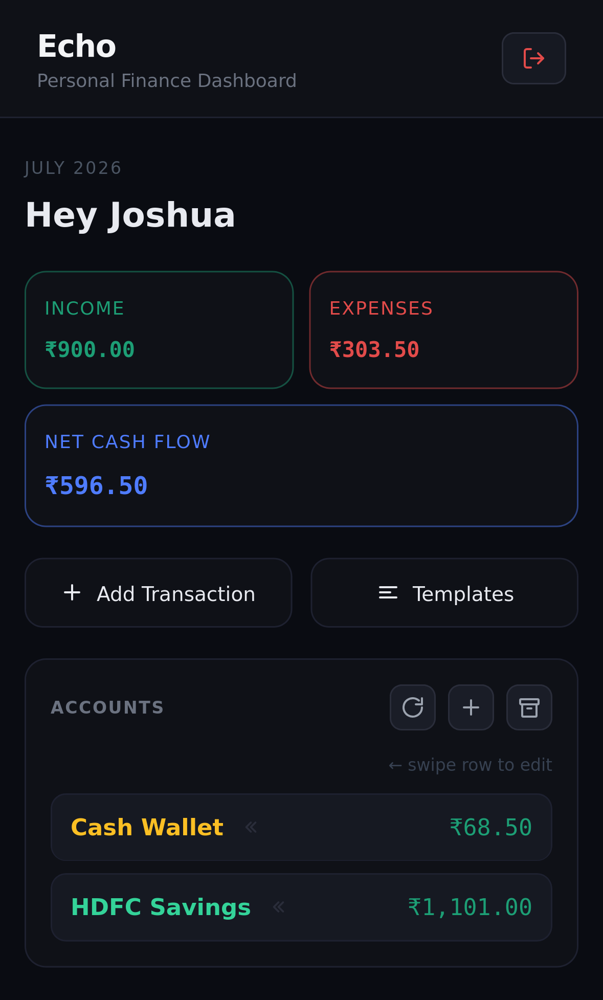
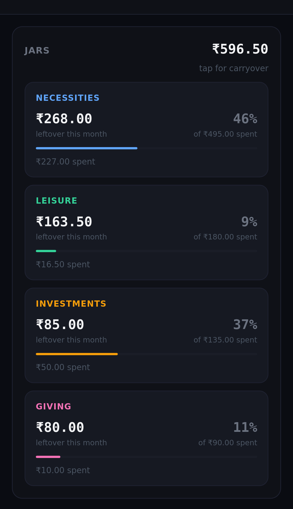
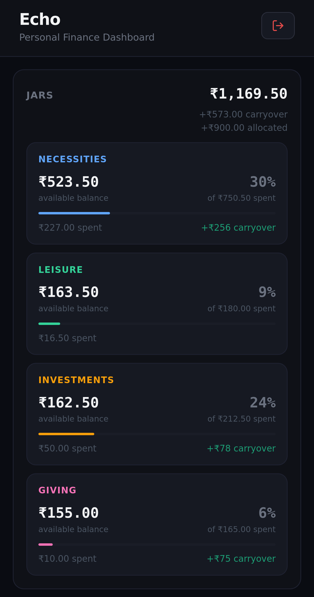
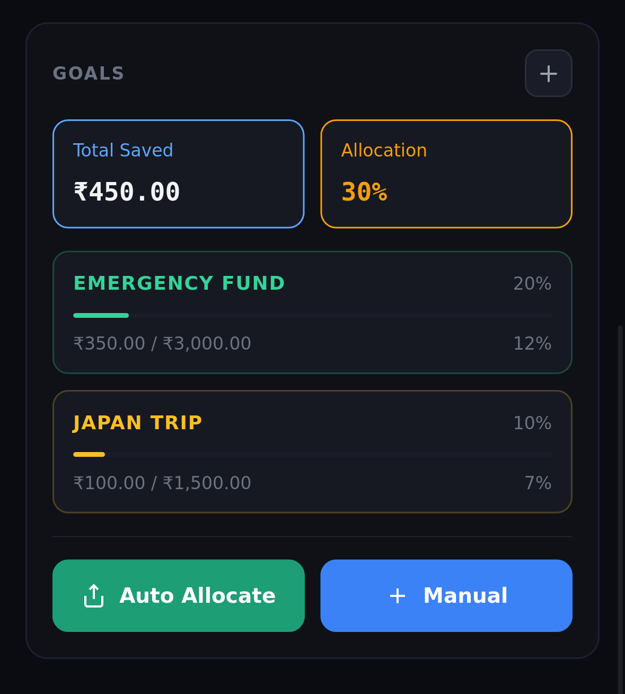
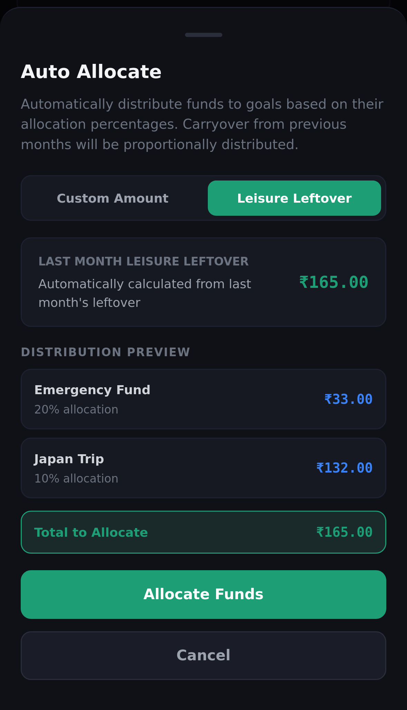
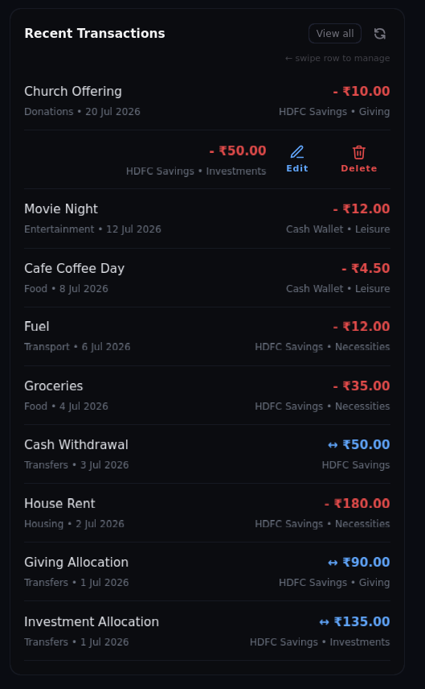
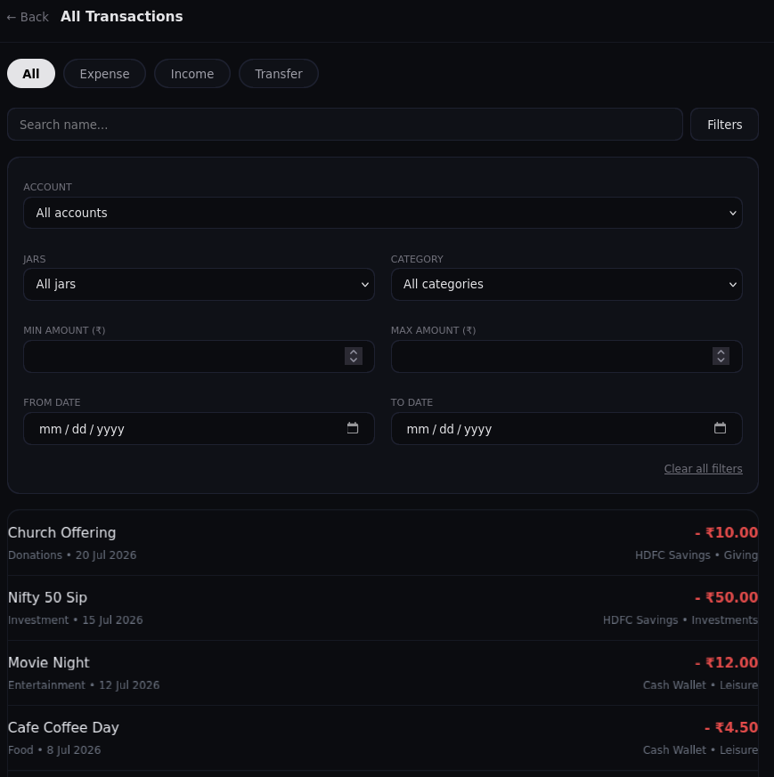

# Echo — Personal Finance Tracker

A modern, full-stack personal finance management application built with **Go**, **React**, and **PostgreSQL**. Track accounts, transactions, budgets, and savings goals with an intuitive, responsive UI.

---

Live Demo: https://echo-demo-x0gb.onrender.com/dashboard

---
## ✨ Features

- **Account Management** — Create, organize, and track multiple financial accounts
- **Transaction Tracking** — Record, edit, and categorize income and expenses with full audit trails
- **Smart Budgeting** — Allocate funds across "jars" (budget categories) with percentage-based allocation
- **Savings Goals** — Set targets with deadlines and monitor progress in real-time
- **Dashboard** — Aggregate view of accounts, balances, recent transactions, and goal progress
- **PIN-Protected Auth** — Secure session-based authentication with PIN login
- **Responsive Design** — Mobile-first interface with Tailwind CSS

---
## 📸 Screenshots









---
## 🛠️ Tech Stack

### Backend

- **Go 1.26** — HTTP server with `chi` router, PostgreSQL driver (`pgx`)
- **PostgreSQL** — Relational database with migration support (`goose`)
- **Docker** — Containerized PostgreSQL for development and testing
- **Session Management** — Gorilla sessions with secure cookies

### Frontend

- **React 19** — Component-based UI with Router for navigation
- **TypeScript** — Type-safe development
- **Tailwind CSS 4** — Utility-first styling
- **Vite** — Lightning-fast build and dev server
- **React Compiler** — Automatic optimization of React components

### Infrastructure

- **Supabase** (PostgreSQL) — Cloud database
- **Render** — Application hosting

---

## 🚀 Getting Started

### Prerequisites

- Go 1.26+
- Node.js 16+
- Docker & Docker Compose (for local PostgreSQL)

### Backend Setup

1. **Clone & navigate**
    
    ```bash
    git clone https://github.com/joshua-sajeev/echo.git
    cd echo/backend
    ```
    
2. **Environment variables**
    
    ```bash
    cp .env.example .env
    ```
    
    Edit `.env` with your database URL and PIN hash.
    
3. **Start PostgreSQL** (via Docker)
    
    ```bash
    docker-compose up -d
    ```
    
4. **Run the server**
    
    ```bash
    go run main.go
    ```
    
    Server starts on `http://localhost:8080`
    

### Frontend Setup

1. **Navigate to frontend**
    
    ```bash
    cd ../frontend
    ```
    
2. **Install dependencies**
    
    ```bash
    npm install
    ```
    
3. **Start dev server**
    
    ```bash
    npm run dev
    ```
    
    App runs on `http://localhost:5173`
    

### Production Build

The React frontend is compiled and served by the Go backend as a monolithic application:

```bash
cd frontend
npm run build
# Output: dist/ folder with optimized production build
```

The Go server automatically serves the pre-built frontend from the static assets directory. This approach eliminates the need for a separate frontend server and enables a **single binary deployment**—ideal for platforms like Render, Railway, or Heroku.

---

## 🌐 Deployment

**Hosted on Render** with:

- Go backend serving both REST API and static frontend
- PostgreSQL via Supabase
- Automatic redeploy on push to main

**Live Demo:** [Coming soon]

---

## 📂 Project Structure

```
echo/
├── backend/                  # Go REST API
│   ├── internal/
│   │   ├── accounts/        # Account management
│   │   ├── transactions/    # Transaction CRUD
│   │   ├── jars/           # Budget allocation
│   │   ├── goals/          # Savings goals tracking
│   │   ├── auth/           # Authentication & sessions
│   │   ├── dashboard/      # Aggregated data endpoints
│   │   ├── db/             # PostgreSQL connection
│   │   └── router/         # Route definitions
│   ├── migrations/          # SQL migrations (goose)
│   ├── bruno/              # API test collection (Bruno)
│   └── main.go
│
└── frontend/               # React application
    ├── src/
    │   ├── pages/         # Dashboard, Transactions, Login
    │   ├── components/    # Reusable UI components
    │   ├── api/          # HTTP client for backend
    │   ├── hooks/        # Custom React hooks
    │   └── utils/        # Helpers (currency, date formatting)
    └── package.json
```

---

## 🔌 API Endpoints

### Authentication

- `POST /auth/login` — Login with PIN
- `POST /auth/logout` — Logout user
- `GET /auth/me` — Get current user

### Accounts

- `GET /accounts` — List all accounts
- `POST /accounts` — Create account
- `PUT /accounts/:id` — Update account
- `DELETE /accounts/:id` — Archive account

### Transactions

- `GET /transactions` — List transactions (paginated)
- `POST /transactions` — Create transaction
- `PUT /transactions/:id` — Update transaction
- `DELETE /transactions/:id` — Delete transaction

### Goals

- `GET /goals` — List savings goals
- `POST /goals` — Create goal
- `PUT /goals/:id` — Update goal
- `POST /goals/:id/progress` — Add manual progress

### Jars (Allocations)

- `GET /jars` — List budget allocations
- `POST /jars` — Create jar
- `PUT /jars/:id` — Update jar allocation

### Dashboard

- `GET /dashboard` — Unified dashboard data (accounts, balances, transactions, goals)

---

## 🧪 Testing

### Backend

Run tests with dockerized PostgreSQL:

```bash
cd backend
go test ./internal/... -count=1
```

**Test Setup** — Uses `TestMain` to spin up a PostgreSQL container once, run migrations, and share the DB pool across all tests (reduces execution time from ~10s to ~3s).

---

## 💡 Key Implementation Details

### Handler-Service-Repository Pattern

Each feature module (accounts, transactions, goals) follows clean architecture:

- **Handler** — HTTP request/response handling
- **Service** — Business logic and validation
- **Repository** — Database operations with mock support for testing

### Session Security

- PIN-based login with bcrypt hashing
- Gorilla sessions for stateful authentication
- Secure cookie configuration

### Database Migrations

SQL migrations in `/migrations` run via `goose` during app initialization.

---

## 🤝 Contributing

Contributions welcome! Please follow these guidelines:

1. Fork the repository
2. Create a feature branch (`git checkout -b feature/amazing-feature`)
3. Commit changes (`git commit -m 'Add amazing feature'`)
4. Push to branch (`git push origin feature/amazing-feature`)
5. Open a Pull Request

---

## 👤 Author

**Joshua Sajeev**

- GitHub: [@joshua-sajeev](https://github.com/joshua-sajeev)
- Project: [Echo Finance Tracker](https://github.com/joshua-sajeev/echo)

---

## 🙋 Support

For issues, questions, or suggestions, please open an [issue](https://github.com/joshua-sajeev/echo/issues) on GitHub.
